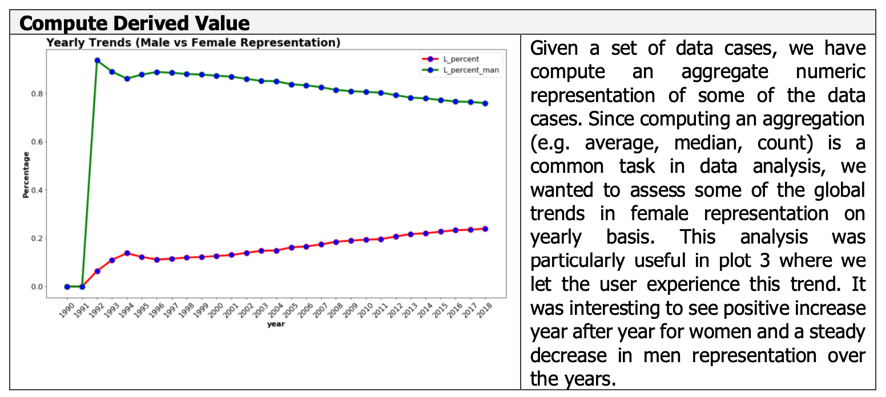

# CMPT767-Project-Visualization
## Who run the world?
## Visualizing the journey of female parliamentarians on global scale:

### Introduction:
The importance of equal participation of women in politics, and especially in decision-making positions, is not simply about equal numbers; it’s about cultivating an environment that values women’s perspectives, recognizes women as change-makers and leverages differences to improve democratic governance. Over the last few years, we have seen a positive trend in the number of women being elected in various parliaments across the globe. As part of this project, we wanted to create an interactive visualization that shows the journey female parliamentarians from across the globe, have travelled since the year 1997.

**Data:**  
For our visualization, our primary data source was created by web scrapping monthly data from [women’s in national parliament website](http://archive.ipu.org/wmn-e/classif-arc.htm). This historical data consists information pertaining to a total of 193 countries associated with their ranks, percentages, counts of women in lower or upper house on a monthly basis from 1997 to 2018. We have observed that most countries which held election every four year had the same values during a 4-year time span. We also used secondary data sources to support some of our plots. These data sources contain [Women in parliament index](https://www.theglobaleconomy.com), [Female Unemployment rate percentage](https://www.theglobaleconomy.com) and [Female Labor Force Participation datasets](https://www.theglobaleconomy.com).

### Visualization Elements:
#### Representation
The process of creating a visual representation from the information is a significant part in the process of creating an information visualization. Since the information that is being represented may not have any obvious visual manifestation this process of creating mapping from the information to the visual representation can be non-trivial. As part of this project, we tried to create different representations by using a combination of various data variables and abstraction processes. At this point we have already classified our features based on their abstract and physical types and intend to encode them with their appropriate combination of visual variables. Since we have created multiple data visualizations, we have identified two plots and explained their data representation process in detail.  
  
  

#### Presentation
While designing a presentation of the above represented data (i.e spatial and temporal layout) – we have considered three principal resources for beneficial exploitation by an interaction designer. These three resources are: display space (ranging from that of a mobile to the vast area of a wall display), time available (to perform the task that the presentation is designed for) and characteristics of the human user. Below are two plots that explains our thought process for data presentation in detail.  
  
  

#### Interaction
Interactive data visualization enables direct actions on a plot to change elements and link between multiple plots. In our project we have added multiple interactive elements in order to make it  
  
  
  

#### Exploratory Data analysis and Tasks
For this project we have used the suggestions presented Amar et al. to create our data tasks. They proposed a set of ten low-level analysis tasks that describe users’ activities while using visualization tools to understand their data. Using this as a reference, we have performed some initial exploratory work to get a better sense of the given dataset. 
  
  
  
  
  

### Youtube Video
[Video Link](https://youtu.be/L3XZHmBvLTw)
